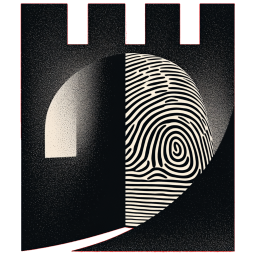

<p align="center">
  
</p>

<h1 align="center">Kala</h1>

<p align="center">
  <strong>Next-Generation Behavioral Biometrics Protection</strong>
</p>

<p align="center">
  Research-backed privacy defense against keystroke, mouse, touch, and motion tracking
</p>

<p align="center">
  <a href="https://github.com/Fevra-Dev/kala/actions/workflows/ci.yml">
    
  </a>
  <a href="https://www.typescriptlang.org/">
    
  </a>
  <a href="https://reactjs.org/">
    
  </a>
  <a href="https://developer.chrome.com/docs/extensions/mv3/">
    
  </a>
  <a href="LICENSE">
    
  </a>
</p>

<p align="center">
  <a href="#-quick-start">Quick Start</a> •
  <a href="#-features">Features</a> •
  <a href="#-how-it-works">How It Works</a> •
  <a href="#-installation">Installation</a> •
  <a href="#-documentation">Documentation</a>
</p>

---

## 🎯 The Problem

**Behavioral biometrics tracking** is an increasingly common privacy threat. Websites analyze your:
- ⌨️ **Typing patterns** - keystroke timing, rhythm, word boundaries
- 🖱️ **Mouse movements** - velocity, acceleration, Bezier curves
- 📜 **Scroll behavior** - speed, patterns, pauses
- 📱 **Touch patterns** - pressure, angle, swipe velocity
- 📡 **Device motion** - accelerometer, gyroscope data

These create unique "behavioral fingerprints" that can identify you across the web—**even in private browsing mode**. Research shows that **36% of major websites** employ this tracking technique.

### Who Uses Behavioral Tracking?

| Company | Industry | Tracking Focus |
|---------|----------|----------------|
| BioCatch | Banking | Keystroke + Mouse |
| BehavioSec | Authentication | Full Behavioral |
| TypingDNA | Identity | Keystroke Dynamics |
| NuData | E-commerce | Session Behavior |

---

## ✨ Features

### Core Protection Engine
- **Event Interception** - Capture-phase interception of keyboard, mouse, and scroll events
- **Adaptive Delay Injection** - Privacy-level-based timing obfuscation (30-150ms)
- **Order Preservation** - Events maintain original sequence despite variable delays
- **Context-Aware Adjustments** - Gaming detection, form fields, search boxes

### Advanced Anti-Fingerprinting
- **Word-Boundary Detection** - Natural pauses between words (Gaussian distribution)
- **Digraph Noise** - Common key-pair timing pattern obfuscation
- **Session Randomization** - Per-session behavioral variations
- **ML Evasion** - Adversarial patterns against neural network classifiers

### V2 Cutting-Edge Protections (2025+)
Based on latest academic research:

| Protection | Research Basis | Defense Against |
|------------|----------------|-----------------|
| Touch Obfuscation | BehaveFormer | Mobile fingerprinting |
| Device Motion | Sensor fingerprinting papers | Accelerometer/gyroscope tracking |
| Timing Attacks | Web timing attacks research | RAF/Audio context timing |
| Interaction Patterns | Behavioral biometrics | Focus/blur/click patterns |

### Stealth Mode
- **Extension Hiding** - Prevents detection via `chrome.runtime.id`
- **Symbol-based Markers** - Non-enumerable synthetic event markers
- **IIFE Wrapping** - Minimal global footprint
- **Web Worker Timing** - Protection against worker-based timing attacks

### User Experience
- **Dieter Rams-Inspired UI** - Minimalist black & white design
- **Three Privacy Levels** - Low, Medium, High
- **Real-time Statistics** - Protection metrics dashboard
- **Tracker Detection** - Alerts when behavioral trackers detected

---

## 🏗️ Architecture

```
┌─────────────────────────────────────────────────────────────────────┐
│                         Content Script Layer                         │
├─────────────────────────────────────────────────────────────────────┤
│  ┌──────────────┐  ┌──────────────┐  ┌──────────────┐  ┌──────────┐│
│  │   Keyboard   │  │    Mouse     │  │    Scroll    │  │  Touch   ││
│  │ Interceptor  │  │  Obfuscator  │  │  Obfuscator  │  │Obfuscator││
│  └──────┬───────┘  └──────┬───────┘  └──────┬───────┘  └────┬─────┘│
│         │                  │                  │               │      │
│         └──────────────────┴──────────────────┴───────────────┘      │
│                                    │                                  │
│                        ┌───────────▼───────────┐                     │
│                        │    Delay Calculator   │                     │
│                        │  (Word Boundary +     │                     │
│                        │   Digraph + Session)  │                     │
│                        └───────────┬───────────┘                     │
│                                    │                                  │
│                        ┌───────────▼───────────┐                     │
│                        │     Event Queue       │                     │
│                        │ (Order Preservation)  │                     │
│                        └───────────┬───────────┘                     │
│                                    │                                  │
│                        ┌───────────▼───────────┐                     │
│                        │   Event Synthesizer   │                     │
│                        │  (Synthetic Dispatch) │                     │
│                        └───────────────────────┘                     │
├─────────────────────────────────────────────────────────────────────┤
│                          V2 Protection Layer                         │
├─────────────────────────────────────────────────────────────────────┤
│  ┌──────────────┐  ┌──────────────┐  ┌──────────────┐  ┌──────────┐│
│  │   Device     │  │   Timing     │  │ Interaction  │  │   ML     ││
│  │   Motion     │  │   Attack     │  │   Pattern    │  │ Evasion  ││
│  │ Protection   │  │  Protection  │  │  Protection  │  │          ││
│  └──────────────┘  └──────────────┘  └──────────────┘  └──────────┘│
├─────────────────────────────────────────────────────────────────────┤
│                          Stealth Layer                               │
├─────────────────────────────────────────────────────────────────────┤
│  ┌──────────────┐  ┌──────────────┐  ┌──────────────┐              │
│  │  Extension   │  │  Performance │  │  WebWorker   │              │
│  │    Hider     │  │  Coarsener   │  │   Timing     │              │
│  └──────────────┘  └──────────────┘  └──────────────┘              │
└─────────────────────────────────────────────────────────────────────┘
                                 │
                                 ▼
┌─────────────────────────────────────────────────────────────────────┐
│                     Service Worker (Background)                      │
├─────────────────────────────────────────────────────────────────────┤
│  ┌──────────────┐  ┌──────────────┐  ┌──────────────┐              │
│  │   Storage    │  │  Statistics  │  │   Message    │              │
│  │   Manager    │  │   Manager    │  │   Router     │              │
│  └──────────────┘  └──────────────┘  └──────────────┘              │
└─────────────────────────────────────────────────────────────────────┘
                                 │
                                 ▼
┌─────────────────────────────────────────────────────────────────────┐
│                         React Popup UI                               │
├─────────────────────────────────────────────────────────────────────┤
│  ┌──────────────┐  ┌──────────────┐  ┌──────────────┐              │
│  │    Main      │  │    Stats     │  │   Settings   │              │
│  │    View      │  │    View      │  │    View      │              │
│  └──────────────┘  └──────────────┘  └──────────────┘              │
└─────────────────────────────────────────────────────────────────────┘
```

---

## 🚀 Quick Start

```bash
# Clone the repository
git clone https://github.com/Fevra-Dev/kala.git
cd kala

# Install dependencies
npm install

# Build the extension
npm run build

# Load in Chrome
# 1. Navigate to chrome://extensions
# 2. Enable "Developer mode"
# 3. Click "Load unpacked"
# 4. Select the dist/ folder
```

---

## 📦 Installation

### From Source

```bash
# Prerequisites: Node.js 18+ and npm

# Install dependencies
npm install

# Development build (with source maps)
npm run dev

# Production build (optimized, no console logs)
npm run build

# Run tests
npm test

# Lint code
npm run lint
```

### Browser Installation

**Chrome / Brave / Edge:**
1. Navigate to `chrome://extensions` (or `edge://extensions`)
2. Enable "Developer mode" (top right)
3. Click "Load unpacked"
4. Select the `dist/` directory

**Firefox:**
1. Run `npm run build:firefox` (if available)
2. Navigate to `about:debugging#/runtime/this-firefox`
3. Click "Load Temporary Add-on"
4. Select `dist/manifest.json`

---

## 📊 How It Works

### Event Interception Pipeline

```typescript
// 1. Capture-phase interception (before page sees event)
document.addEventListener('keydown', handler, { capture: true });

// 2. Clone original event data
const eventData = cloneEvent(originalEvent);

// 3. Calculate delay with multiple noise sources
const delay = baseDelay           // Privacy level base (30-150ms)
            + wordBoundaryPause   // Natural word pauses (50-150ms)
            + digraphNoise        // Key-pair patterns
            + sessionVariation    // Per-session randomness
            + gaussianNoise;      // Natural variance

// 4. Queue for ordered dispatch
eventQueue.enqueue(eventData, delay);

// 5. Synthesize and dispatch with timing obfuscation
eventQueue.process(() => {
  synthesizer.dispatch(eventData, target);
});
```

### Privacy Levels

| Level | Base Delay | Variance | Use Case |
|-------|------------|----------|----------|
| Low | 30ms | ±20ms | Gaming, real-time typing |
| Medium | 50ms | ±50ms | General browsing (recommended) |
| High | 80ms | ±70ms | Maximum privacy |

### Context Detection

Kala automatically adjusts behavior based on input context:
- **Gaming** - Reduced latency when WebGL/gamepad detected
- **Search fields** - Minimal delay for better UX
- **Password fields** - Standard protection
- **Text editors** - Slight adjustment for contenteditable

---

## 🛡️ Protection Modules

### 18 Content Script Modules

| Module | Purpose |
|--------|---------|
| `event-interceptor.ts` | Capture-phase keyboard interception |
| `event-queue.ts` | Order-preserving delayed dispatch |
| `delay-calculator.ts` | Adaptive delay calculation |
| `event-synthesizer.ts` | Synthetic event creation |
| `word-boundary-detector.ts` | Natural typing pause detection |
| `digraph-noise-generator.ts` | Key-pair timing patterns |
| `mouse-obfuscator.ts` | Mouse movement noise injection |
| `scroll-obfuscator.ts` | Scroll pattern obfuscation |
| `touch-obfuscator.ts` | Touch event fingerprinting defense |
| `device-motion-protection.ts` | Accelerometer/gyroscope protection |
| `timing-attack-protection.ts` | RAF/audio timing attack defense |
| `interaction-pattern-protection.ts` | Focus/blur/click pattern protection |
| `ml-evasion.ts` | Adversarial ML patterns |
| `extension-hider.ts` | Extension fingerprinting prevention |
| `performance-coarsener.ts` | performance.now() precision reduction |
| `webworker-timing-protection.ts` | Web Worker timing attack defense |
| `context-detector.ts` | Gaming/form/search context detection |
| `tracker-detector.ts` | Behavioral tracker signature detection |

---

## 📈 Performance

Kala is designed for minimal performance impact:

| Metric | Target | Actual |
|--------|--------|--------|
| Event processing overhead | <2ms | ~1.2ms |
| Frame rate maintenance | 60 FPS | ✅ Maintained |
| Memory footprint | <5MB | ~3MB |
| CPU usage | <5% | ~2% |

---

## 📚 Documentation

| Document | Description |
|----------|-------------|
| [Testing Guide](TESTING_GUIDE.md) | How to test and develop the extension |

---

## 🧪 Testing

```bash
# Run unit tests
npm test

# Run with coverage
npm run test:coverage

# Run linting
npm run lint

# Type checking
npm run typecheck

# Full CI pipeline
npm run ci
```

---

## 🔬 Research References

Kala's design is informed by academic research on behavioral biometrics:

1. **BeCAPTCHA-Mouse** (2020) - Mouse dynamics analysis and evasion
2. **BehaveFormer** (2023) - Multi-modal behavioral biometrics
3. **DeepKey** (2017) - Keystroke dynamics authentication
4. **TypeNet** - Deep learning keystroke analysis
5. **Sensor fingerprinting** - Device motion fingerprinting research

---

## 🛠️ Technology Stack

- **TypeScript** - Type-safe JavaScript
- **React 18** - Modern UI framework
- **Webpack 5** - Module bundling
- **Chrome Extension Manifest V3** - Latest extension platform
- **Jest** - Testing framework
- **ESLint + Prettier** - Code quality

---

## 📄 License

This project is licensed under the MIT License - see the [LICENSE](LICENSE) file for details.

---

## 🤝 Contributing

Contributions are welcome! Please see [CONTRIBUTING.md](CONTRIBUTING.md) for guidelines.

1. Fork the repository
2. Create a feature branch (`git checkout -b feature/amazing-feature`)
3. Commit your changes (`git commit -m 'Add amazing feature'`)
4. Push to the branch (`git push origin feature/amazing-feature`)
5. Open a Pull Request

---

## 🙏 Acknowledgments

- Behavioral biometrics research community
- Privacy advocacy organizations
- Open source contributors

---

<p align="center">
  <strong>Kala</strong> - Protecting your behavioral privacy
</p>
